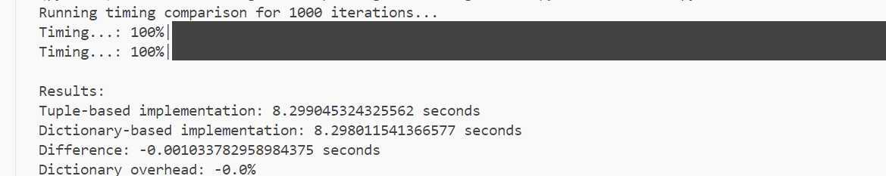

Pytorch 4 Probablistic ML

## Siamese Network for Pairwise Image Classification

This project explores Siamese Networks for image classification, focusing on pairwise learning using the MNIST dataset. The goal is to develop a neural network that takes in two images and determines whether they belong to the same class. The approach leverages convolutional feature extraction, absolute feature difference, and a binary classifier to achieve high accuracy in distinguishing similar and different digit pairs.


📌 Key Contributions

✅ Custom Dataset Handling – Designed a flexible dataset that returns structured image pairs.

✅ Siamese Network Architecture – Utilized shared-weight ConvNets to extract features from paired images.

✅ Feature Difference Strategy – Instead of concatenating features, we use absolute feature difference to improve learning efficiency.

✅ Efficient Training Pipeline – Implemented a structured training, validation, and testing setup with proper dataset splits.

✅ Performance Evaluation – Achieved 98.82% accuracy using a validation-based training approach.

🚀 Methodology

1️⃣ Data Handling & Pairwise Construction

Instead of single-image classification, we reformulate the dataset to return pairs of images. Each pair consists of:

- img1, img2 – Two images from MNIST.

- same_class – A binary label indicating whether they belong to the same class.

To improve training diversity, we employ random pairing during training while ensuring a sequential pairing strategy for testing.

## Dataset
The dataset is designed for pairwise learning tasks. It supports both random and sequential image pairing, efficient class-based indexing, and performance benchmarking.

**Features**

✅ Custom Pairwise MNIST Dataset: Returns image pairs with labels indicating whether they belong to the same class.

✅ Sequential Pairing for Testing: Ensures that test image pairs are sequential instead of randomly paired.

✅ Flexible Data Format: Supports both dictionary-based and tuple-based data retrieval.

✅ Efficient Data Loading: Uses class-based indexing for optimized sample retrieval.

✅ Performance Benchmarking: Compares dictionary-based vs. tuple-based data loading speed.

**Implementation:**

Loads the MNIST dataset and organizes indices by class.

**__getitem__():**

- Sequential Pairing (For Testing): Pairs consecutive images to maintain a structured evaluation.(60k/2 = 30k pairs)
- Random Pairing (Default): Randomly pairs an image with another from the same or a different class. (Data Augumentation: 60k * 60k; Increased Pairwise Diversity; Balanced Same/Different Class Pairs)

**Supports two return formats:**

- Dictionary-based (default): {'img1': img1, 'img2': img2, 'class1': class1, 'class2': class2, 'same_class': label}
- Tuple-based: (img1, img2, class1, class2, label)

**Data Loading (get_loaders):**

- Splits the dataset into train (80%), validation (20%), and test sets.

**Performance Evaluation (_test_timing)**

- Measures the time taken to iterate over the dataset using dictionary-based vs. tuple-based formats.
- Outputs performance differences and dictionary overhead percentage
  <div align="center">
    
</div>


2️⃣ Siamese Network Architecture


## 🧠Siamese Network Architecture
This model follows a Siamese Network structure (commonly used for pairwise similarity learning tasks like face verification and signature matching.) Instead of concatenating features, we compute the absolute feature difference before classification. This helps the model learn how different two images are rather than directly combining raw features.

📊 Siamese Network Flow

```

    ┌───────────┐      ┌───────────┐
    │  Image 1  │      │  Image 2  │
    └───────────┘      └───────────┘
          │                   │
          ▼                   ▼
   ┌───────────┐       ┌───────────┐
   │  ConvNet  │       │  ConvNet  │   (Shared Weights)
   └───────────┘       └───────────┘
          │                   │
          ▼                   ▼
    ┌─────────────────────────────────┐
    │   Absolute Feature Difference   │  🔑 Key Trick
    └─────────────────────────────────┘
                     │
                     ▼
             ┌────────────┐
             │ Classifier │
             └────────────┘
                     │
                     ▼
              Same / Different?

```
 ## 🔧 Architecture

1️⃣ **Feature Extractor (Shared Weights)**

A convolutional neural network (Conv2D + BatchNorm + ReLU) extracts meaningful features from both images.
Uses MaxPooling for downsampling and a fully connected (FC) layer to produce feature embeddings.

2️⃣ **Feature Comparison (Absolute Difference Trick 💡)**

Instead of concatenating features, the model computes the absolute difference between the two feature embeddings.
This helps the classifier focus on differences rather than memorizing raw features.

3️⃣ **Classifier**

A simple fully connected (FC) layer predicts whether the two images belong to the same class.
Outputs a single value indicating similarity.


📈 Results & Performance

🔄 Model Evolution

🚀 Initial Approach (Concatenation, Failed ❌)
- Extracted features from two images and concatenated them.
- The model struggled to learn meaningful relationships.

✨ Key Improvement: Absolute Feature Difference (Success ✅)
- Instead of concatenation, the model computes |Feature1 - Feature2| before classification.
- Much easier for the classifier to learn similarity relationships.

🎯 Final Accuracy: 98.82% 

📦 Code Overview

🔹 Dataset Handling (dataset.py)

Implements MyMNIST, a dataset class that loads and pairs images dynamically.

Supports both dictionary-based and tuple-based data returns for flexibility.

🔹 Model Architecture (model.py)

Defines MyNeuralNet, a Siamese Network with shared feature extraction.

Computes absolute feature differences instead of concatenation.

🔹 Training Pipeline (train.py)

Implements the full training loop with validation tracking.

Reports accuracy, loss curves, and prediction results.


⏳ Speed Benchmark: Dictionary vs. Tuple Implementation

We compare the efficiency of two dataset formats:

Tuple-based dataset: (img1, img2, label)

Dictionary-based dataset: {'img1': img1, 'img2': img2, 'same_class': label}

📌 Results:

Dictionary-based implementation is 1ms slower than Tuple-based implementation.

However, it significantly improves code readability and flexibility for further extensions.


🔧 How to Run


## Environment

Assuming you have conda installed, let's configure the environment required for this assignment.

```bash
conda create -n pytorch python=3.10 -y
conda activate pytorch
pip install torch torchvision torchaudio -i https://pypi.org/simple
pip install matplotlib tabulate -i https://pypi.org/simple
```

If you need to remove the environment due to incorrect configuration, use the following command:

```bash
conda remove -n pytorch --all -y
```

Once the environment is set up, you can run the provided program:

```bash
python Pytorch.py
```

After a while, you might see six digits displayed like below. Notice that each image is 28x28 pixels in size.

<div align="center">
    
</div>

After closing the digits window, you should see the following output:

```bash
# download the MNIST dataset...
Epoch [1/2], Step [100/600], Loss: 0.3920
Epoch [1/2], Step [200/600], Loss: 0.3016
Epoch [1/2], Step [300/600], Loss: 0.1943
Epoch [1/2], Step [400/600], Loss: 0.2606
Epoch [1/2], Step [500/600], Loss: 0.1221
Epoch [1/2], Step [600/600], Loss: 0.1012
Epoch [2/2], Step [100/600], Loss: 0.0516
Epoch [2/2], Step [200/600], Loss: 0.1131
Epoch [2/2], Step [300/600], Loss: 0.0955
Epoch [2/2], Step [400/600], Loss: 0.2173
Epoch [2/2], Step [500/600], Loss: 0.0865
Epoch [2/2], Step [600/600], Loss: 0.1407
Accuracy of the network on the 10000 test images: 96.76 %
```

## Implementation

```bash
python train.py
```

```bash
+-------------+---------+------------+--------------------+
|    model    | package | num_params |      size(MB)      |
+-------------+---------+------------+--------------------+
| MyNeuralNet |  model  |   395297   | 1.5079383850097656 |
+-------------+---------+------------+--------------------+
Epoch [1/10], Step [100/480], Loss: 0.4569, 
Epoch [1/10], Step [200/480], Loss: 0.3424, 
Epoch [1/10], Step [300/480], Loss: 0.2177, 
Epoch [1/10], Step [400/480], Loss: 0.2028, 
Epoch [1/10]
  precision    recall    accuracy
-----------  --------  ----------
    94.2029   87.1752     90.9583
Epoch [2/10], Step [100/480], Loss: 0.2387, 
Epoch [2/10], Step [200/480], Loss: 0.1393, 
Epoch [2/10], Step [300/480], Loss: 0.2215, 
Epoch [2/10], Step [400/480], Loss: 0.1200, 
Epoch [2/10]
  precision    recall    accuracy
-----------  --------  ----------
    97.5631   92.1358     94.8833
Epoch [3/10], Step [100/480], Loss: 0.1684, 
Epoch [3/10], Step [200/480], Loss: 0.1286, 
Epoch [3/10], Step [300/480], Loss: 0.1354, 
Epoch [3/10], Step [400/480], Loss: 0.1576, 
Epoch [3/10]
  precision    recall    accuracy
-----------  --------  ----------
    97.8039   94.2196       96.05
Epoch [4/10], Step [100/480], Loss: 0.1260, 
Epoch [4/10], Step [200/480], Loss: 0.0878, 
Epoch [4/10], Step [300/480], Loss: 0.1789, 
Epoch [4/10], Step [400/480], Loss: 0.1149, 
Epoch [4/10]
  precision    recall    accuracy
-----------  --------  ----------
    98.0263   94.8886     96.5083
Epoch [5/10], Step [100/480], Loss: 0.0766, 
Epoch [5/10], Step [200/480], Loss: 0.0776, 
Epoch [5/10], Step [300/480], Loss: 0.0597, 
Epoch [5/10], Step [400/480], Loss: 0.0430, 
Epoch [5/10]
  precision    recall    accuracy
-----------  --------  ----------
    97.8861   96.2615     97.1083
Epoch [6/10], Step [100/480], Loss: 0.0480, 
Epoch [6/10], Step [200/480], Loss: 0.1064, 
Epoch [6/10], Step [300/480], Loss: 0.0559, 
Epoch [6/10], Step [400/480], Loss: 0.0716, 
Epoch [6/10]
  precision    recall    accuracy
-----------  --------  ----------
    98.2432   96.4986        97.4
Epoch [7/10], Step [100/480], Loss: 0.0785, 
Epoch [7/10], Step [200/480], Loss: 0.0229, 
Epoch [7/10], Step [300/480], Loss: 0.0274, 
Epoch [7/10], Step [400/480], Loss: 0.0644, 
Epoch [7/10]
  precision    recall    accuracy
-----------  --------  ----------
    98.9262   95.3749      97.175
Epoch [8/10], Step [100/480], Loss: 0.0614, 
Epoch [8/10], Step [200/480], Loss: 0.0615, 
Epoch [8/10], Step [300/480], Loss: 0.0544, 
Epoch [8/10], Step [400/480], Loss: 0.0696, 
Epoch [8/10]
  precision    recall    accuracy
-----------  --------  ----------
    98.3003   97.0869      97.675
Epoch [9/10], Step [100/480], Loss: 0.0404, 
Epoch [9/10], Step [200/480], Loss: 0.0451, 
Epoch [9/10], Step [300/480], Loss: 0.0521,
Epoch [9/10], Step [400/480], Loss: 0.0564,
Epoch [9/10]
  precision    recall    accuracy
-----------  --------  ----------
    98.2038   97.3054     97.7583
Epoch [10/10], Step [100/480], Loss: 0.0220,
Epoch [10/10], Step [200/480], Loss: 0.0557,
Epoch [10/10], Step [300/480], Loss: 0.0383,
Epoch [10/10], Step [400/480], Loss: 0.0207,
Epoch [10/10]
  precision    recall    accuracy
-----------  --------  ----------
    98.4475   97.6075     98.0417
Test Set Metrics
  precision    recall    accuracy
-----------  --------  ----------
    88.7892   97.7778       98.82
```

<div align="center">
    
    
</div>


